# Session 19 - Cloud & Terraform in Action

An end-to-end Terraform project that builds a small AWS network with a web server and a storage bucket.

> **Note:** No AWS account was used. The real `hashicorp/aws` provider is pointed at
> [LocalStack](https://localstack.cloud), a local AWS emulator running in Docker.
> The same code deploys to real AWS by setting `use_localstack = false`.

## What This Demonstrates

| Concept | Where |
|---|---|
| Provider | `versions.tf` - `hashicorp/aws ~> 6.0`, LocalStack endpoints |
| Variables | `variables.tf`, `terraform.tfvars.example` |
| Resources | `main.tf` - VPC, subnet, IGW, route table, SG, EC2, S3 |
| Outputs | `outputs.tf` |
| Dependencies | Implicit (`aws_vpc.main.id`, ...) and explicit (`depends_on` on the EC2 instance) |
| State | `terraform state list`, `terraform.tfstate` |
| Lifecycle | `plan` -> `apply` -> `destroy` |

## Architecture

```text
                        Internet
                           |
                  +--------v--------+
                  | Internet Gateway|
                  +--------+--------+
                           |
+--------------------------v------------------------------+
| VPC 10.20.0.0/16                                         |
|                                                          |
|   Route Table (0.0.0.0/0 -> IGW)                         |
|            |                                             |
|   +--------v----------------------------------+          |
|   | Public Subnet 10.20.1.0/24                |          |
|   |   +-----------------------------------+   |          |
|   |   | Security Group (80, 443 in)       |   |          |
|   |   |   [ EC2 t3.micro ]                |   |          |
|   |   +-----------------------------------+   |          |
|   +-------------------------------------------+          |
+----------------------------------------------------------+

   [ S3 Bucket ]   (regional service, outside the VPC)
```

Dependency order: `VPC -> {Subnet, IGW, Security Group} -> Route Table -> Association -> EC2`. `S3` is independent.

## Project Structure

```text
.
|-- versions.tf               provider + LocalStack switch
|-- variables.tf              inputs
|-- main.tf                   resources
|-- outputs.tf                outputs
|-- terraform.tfvars.example  sample values
|-- screenshot-steps.sh       runs every demo command with pauses
`-- docs/screenshots/         evidence
```

## Prerequisites

- Terraform >= 1.6, Docker, AWS CLI (only used to verify against LocalStack)

## Run It

Start LocalStack:

```bash
docker run -d --name localstack -p 4566:4566 localstack/localstack
```

Then:

```bash
cp terraform.tfvars.example terraform.tfvars
terraform init
terraform fmt -check
terraform validate
terraform plan
terraform apply          # type: yes
terraform output
terraform state list
```

Verify the resources exist (LocalStack):

```bash
export AWS_ACCESS_KEY_ID=test AWS_SECRET_ACCESS_KEY=test AWS_DEFAULT_REGION=ap-south-1
aws --endpoint-url=http://localhost:4566 ec2 describe-vpcs --query 'Vpcs[].{Id:VpcId,Cidr:CidrBlock}'
aws --endpoint-url=http://localhost:4566 ec2 describe-instances --query 'Reservations[].Instances[].InstanceId'
aws --endpoint-url=http://localhost:4566 s3 ls
```

Tear down:

```bash
terraform plan -destroy
terraform destroy        # type: yes
docker rm -f localstack
```

Expected: `Apply complete! Resources: 8 added` and `Destroy complete! Resources: 8 destroyed.`

### Using real AWS instead

Set `use_localstack = false` in `terraform.tfvars`, configure AWS credentials, set `ami_id` to a valid AMI for your region, and use a globally unique `bucket_name`.

## Screenshots

All screenshots were taken against LocalStack (no AWS account).

### 1. Environment and provider setup

LocalStack running with EC2, S3 and IAM available:

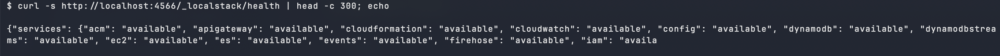

`terraform init` - downloads the `hashicorp/aws` provider:

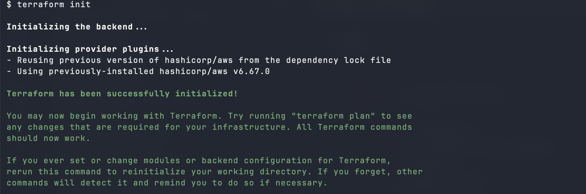

`terraform fmt -check && terraform validate`:

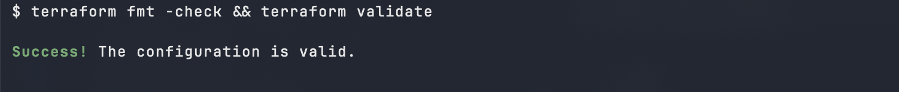

### 2. terraform plan

Preview of the resources to be created (`+ create`):

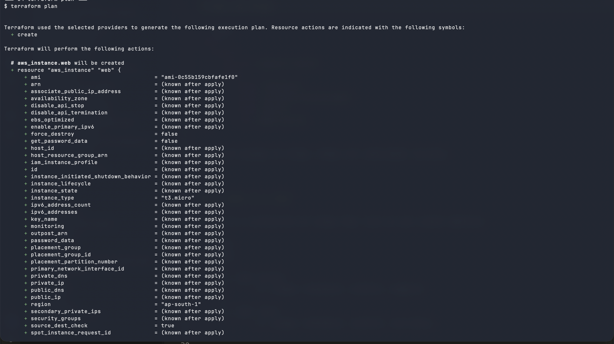

### 3. terraform apply

`terraform apply -auto-approve`:

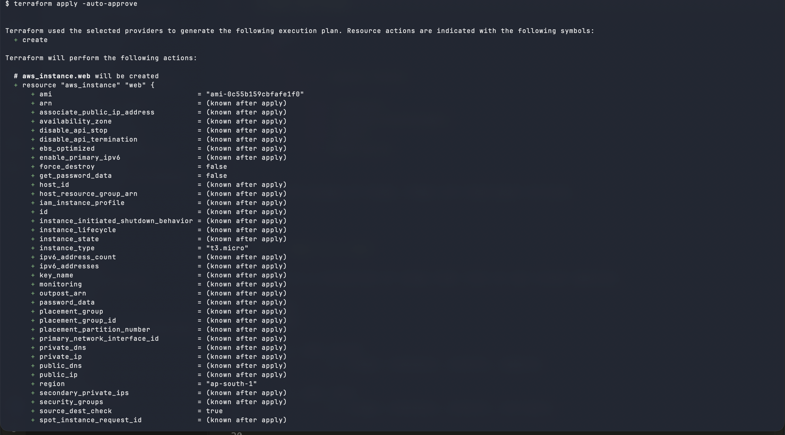

`Apply complete! Resources: 8 added` with the outputs:

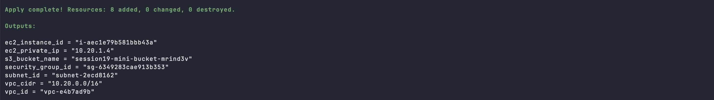

### 4. Outputs and state

`terraform output`:

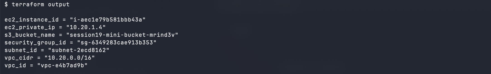

`terraform state list` - the 8 tracked resources:

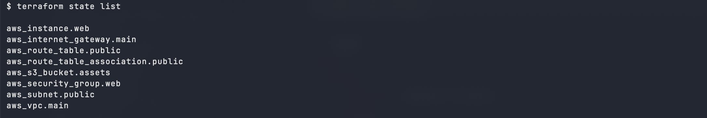

### 5. AWS resources (verified with the AWS CLI against LocalStack)

VPC `10.20.0.0/16`:

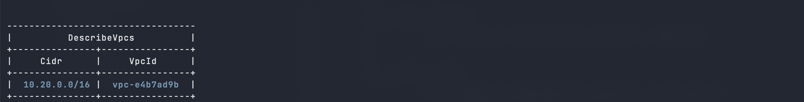

Public subnet `10.20.1.0/24` in `ap-south-1a`:

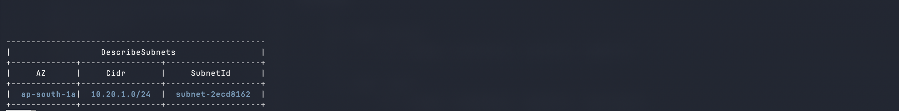

Security group `session19-mini-web-sg`:

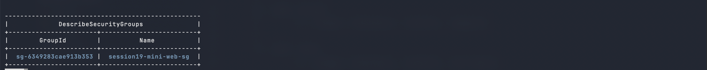

EC2 `t3.micro` running in the public subnet:

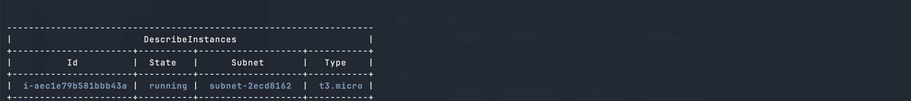

### 6. terraform destroy

`terraform plan -destroy`:

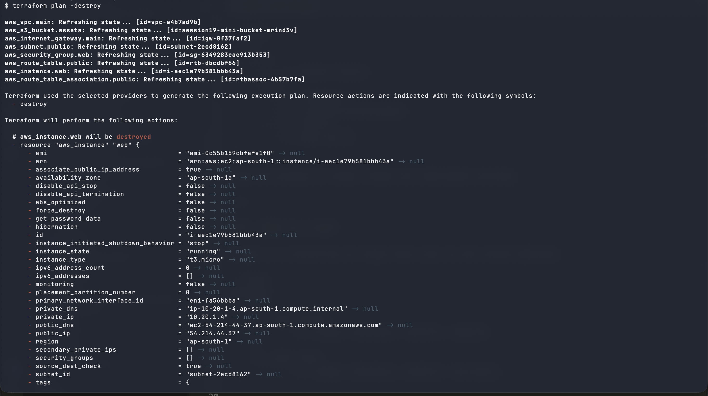

`terraform destroy -auto-approve`:

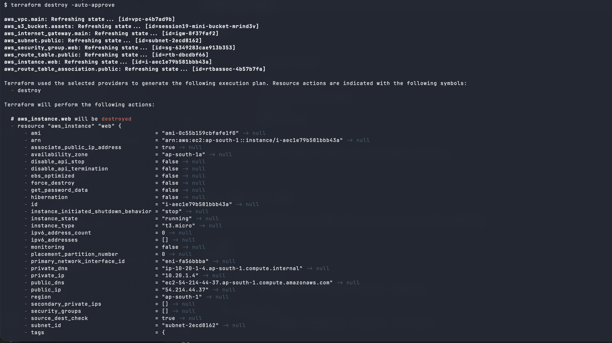

Reverse dependency order, `Destroy complete! Resources: 8 destroyed.`:

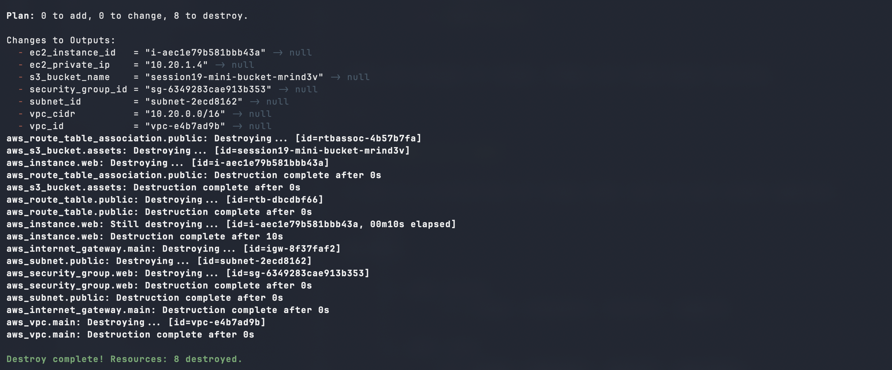

State is empty afterwards:

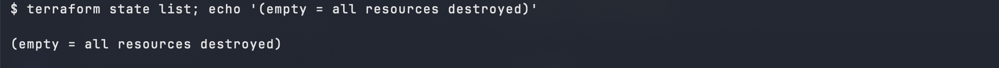

## Key Concepts

- **plan vs apply:** `plan` previews changes without touching anything; `apply` executes them.
- **State:** `terraform.tfstate` maps config to real resources; Terraform diffs against it to decide what to change.
- **Dependencies:** references like `aws_vpc.main.id` create implicit ordering; `depends_on` forces explicit ordering.
- **destroy:** removes everything in the state, in reverse dependency order.
